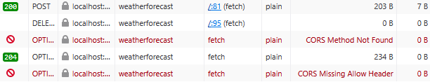
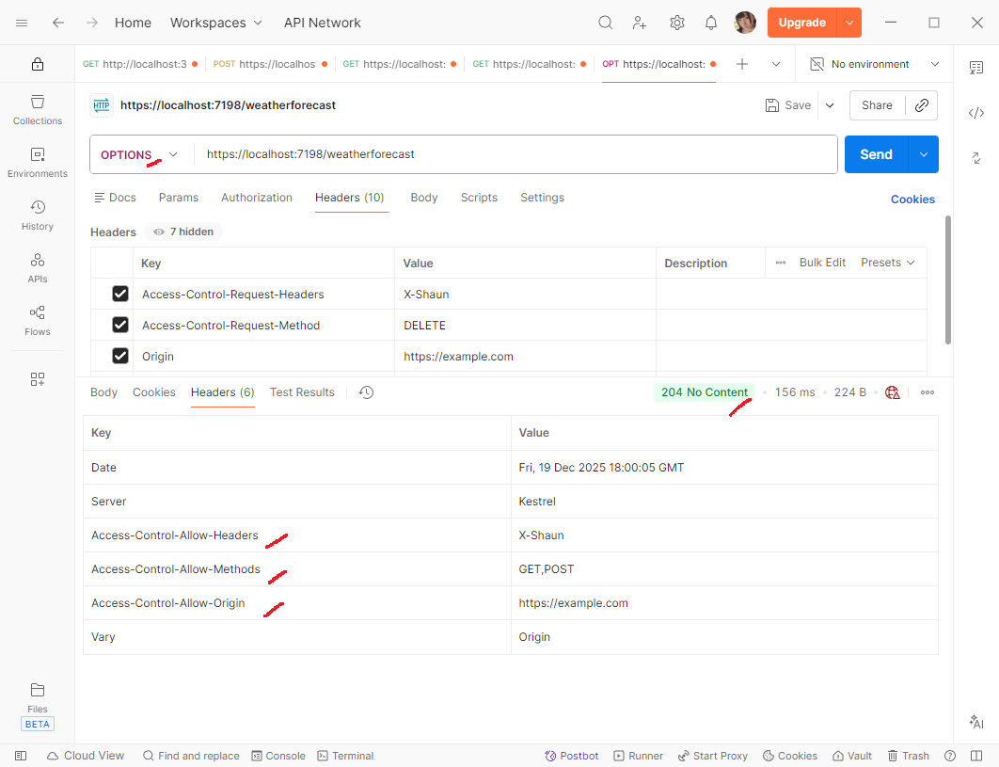

# Cross Origin Resource Sharing (CORS) Demo

This project is to demonstrate the uses of CORS and how it's configured in ASP.NET WebApi project.

## CORS

CORS is a browser security protocol that prevents the call to API that have different origins than the current webpage.

Imagine you are at `https://example.com`. The website is trying to call API from `https://other.com`. Wouldn't that be shady? What if the owner of the API don't allow the uses of it? That might happen if you happen to fall into a phishing website that tries to call the real API to steal your info.

Hence, all standard browser will respect the CORS protocol and refuses to load any resources that violates the policy.

## Preflight Request

The preflight request is a special call to the `OPTIONS` method of the API to get the necessary information for CORS so that the browser will reject or allow the actual call to the API. It happens automatically by browser before requests that met the special requirements. Refer to this [section](https://learn.microsoft.com/en-us/aspnet/core/security/cors?view=aspnetcore-10.0#preflight-requests) of the Microsoft Docs to understand more on the special requirements.

The following are the failed OPTIONS call from the browwser (Firefox).

## ASP.NET Cors Middleware

ASP.NET WebAPI have the `.UseCors` middleware that can configure the CORS option. Make sure that this middleware is before any auths middleware so that it can be accessed anonymously.

The OPTIONS endpoint will always return `204 No Content`, but with varying headers based on the request:
1. If the requestor **Origin** is not allowed, it will not return any headers in the response. The browser will understood this as illegitimate call and refuse to call the triggering API.
1. If the requestor **Origin** is allowed, it will return with header `Access-Control-Allow-Origin`, `Access-Control-Allow-Headers` if applicable and `Access-Control-Allow-Methods` if applicable. Any headers or methods that is not in the value will be refused by the browser.
1. It might return `405 Method Not Allowed` if the `Origin` is missing from the header.

## Demo

This demo simulates a HTML client calling a backend API. The backend API have endpoint `/weatherforecast` that accepts HTTP GET, POST and DELETE. The POST and DELETE method is empty and not doing anything.

The frontend HTML will try to call the API with both allowed and disallowed headers and methods. Only allowed headers and methods will be able to call the API from the browser.
The backendAPI have configured the allowed origins, headers and methods in `appsettings.json`. Modify the values to experiment for yourself.

### Getting Started

1. Go into the `Frontend` project and run `npm start`. This will serve a HTML page at `http://localhost:8000`.
1. Start the `WebApi` project. This will serve the API at `https://localhost:7198`

