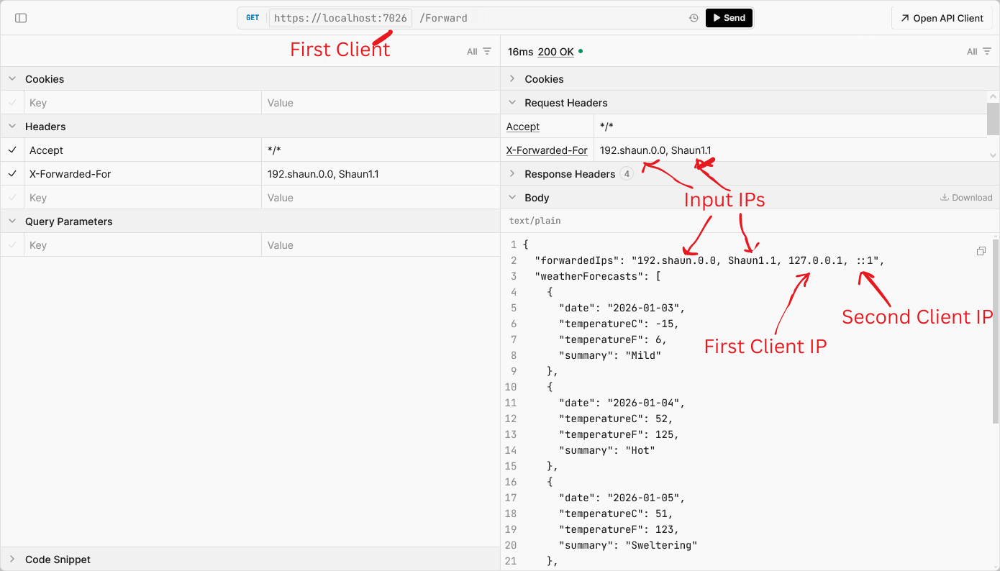

# IpForwarding

This is a demo for forwarding `X-Forwarded-For` header properly in ASP.NET Core WebAPI.

## Demo

The client (First) is calling the proxy (Second) and is then forwarded to the destination (Third). It is expected to have at least 2 IP addresses inside the XFF when reached the destination.

The screenshot below shows when the user calls the (First) client, providing `X-Forwarded-For` header and the response includes all the expected IP addresses. The (First) client appends the value `172.0.0.1` loopback address into the chain, and the (Second) client appends the value `::1` IPv6 loopback address into the chain.

